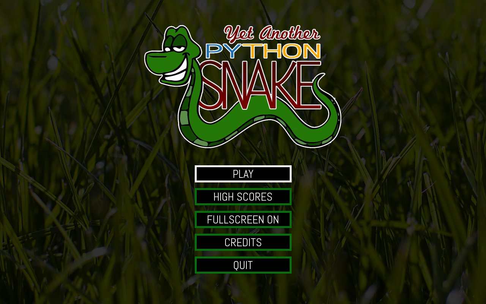
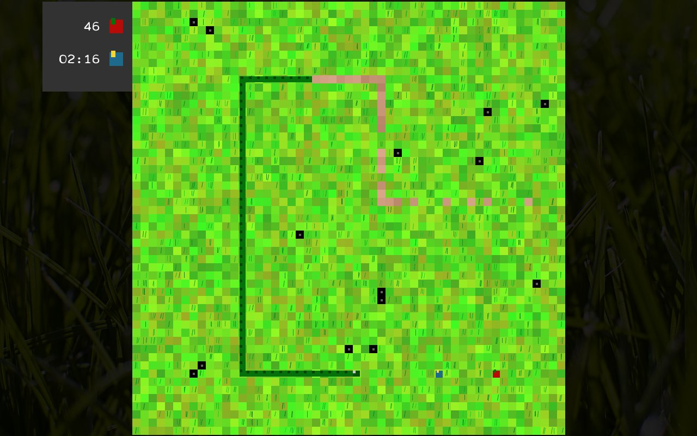
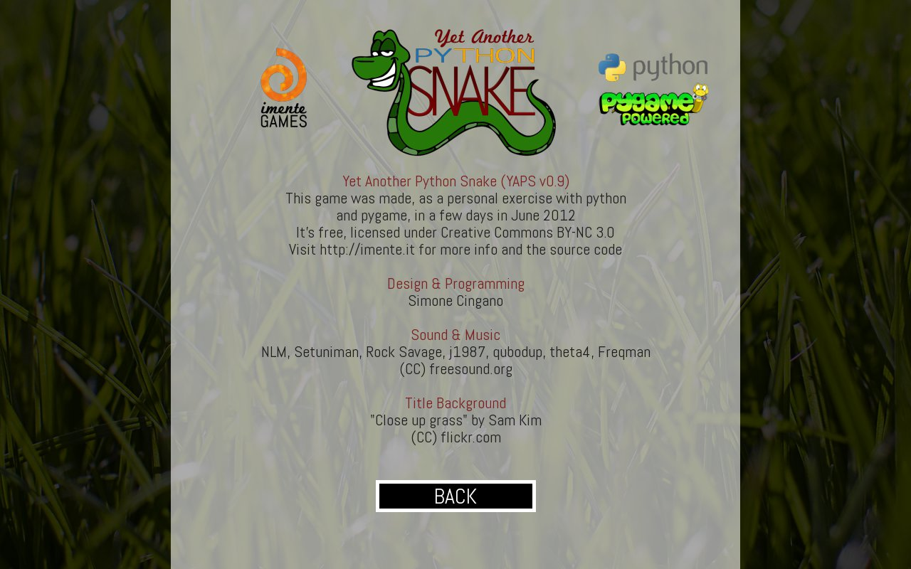

 

**YetAnotherPythonSnake** 0.93 
**Author:** Simone Cingano (simonecingano@gmail.com) (https://simonecingano.it) 
**Pygame Page:** https://www.pygame.org/project-YetAnotherPythonSnake-2393-.html 
**GIT Repository:** https://github.com/yupswing/yaps 
**Licence:** MIT

## SCREENSHOTS

## DEPENDENCIES

You might need to install some of these before running the game:

**Python:** https://www.python.org/ 
**PyGame:** https://www.pygame.org/

Game tested on Python 2.7/3.0 and PyGame 1.9 on Linux and Mac OS X 

## RUNNING THE GAME

Open a terminal/console and "cd" to the game directory and run:
`python yaps.py`

## HOW TO PLAY THE GAME

`Arrows` or `WASD` to move 
`P` to pause 
`M` to toggle music

Red apples give 1 point
Blue apples give 5 points (they disappear quickly)
Black Blocks appear casually on the map. Avoid them!
And last, but not least, don't eat yourself!

## SOME INFOS AND CREDITS

This game is brought to you by Simone Cingano's not-so-skilled hands.

I took inspiration from Invention by XASM Studio to learn how
to program in PyGame (Thank you!)

This is my first game in pygame, and I know there is a lot of mess
in the code.

Anyway... let me give credit who deserves it:

**Sound & Music** 
NLM, Setuniman, Rock Savage, j1987, qubodup, theta4, Freqman  
(CC) freesound.org

**Title Background Photo** 
"Close up grass" by Sam Kim  
(CC) flickr.com"

PS: There is no active website, I'm workin' on it

## CHANGELOG

**YAPS 0.93** [2020/07/31]

- fix highscore

**YAPS 0.92** [2015/01/14]

- minor fixes
- licence switched to MIT

**YAPS 0.91** [2012/06/27]

- fullscreen mode on/off
- some fixes to ensure compatibility with python3 [not tested]
- highscore and preferences in "local" folder instead of "data"
- sys.quit() on quit

**YAPS 0.9** [2012/06/24]

- brand new code with awesome features
- play as a snake that eats apples and moves orthogonally
- highscores
- vector graphics
- resolution independent

**YAPS 0.1** [2012/06/21]

- First prototype
